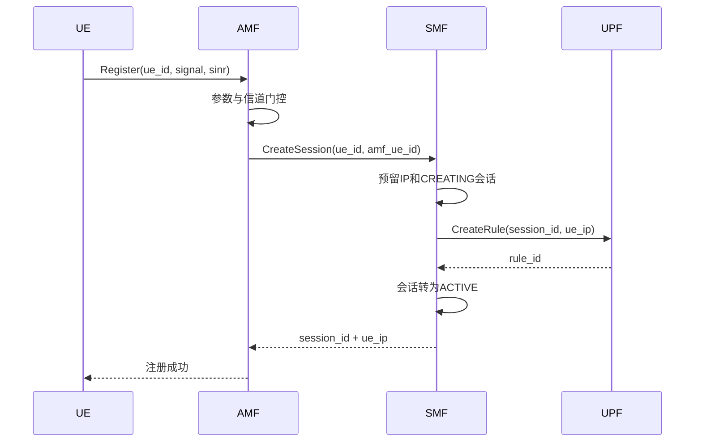
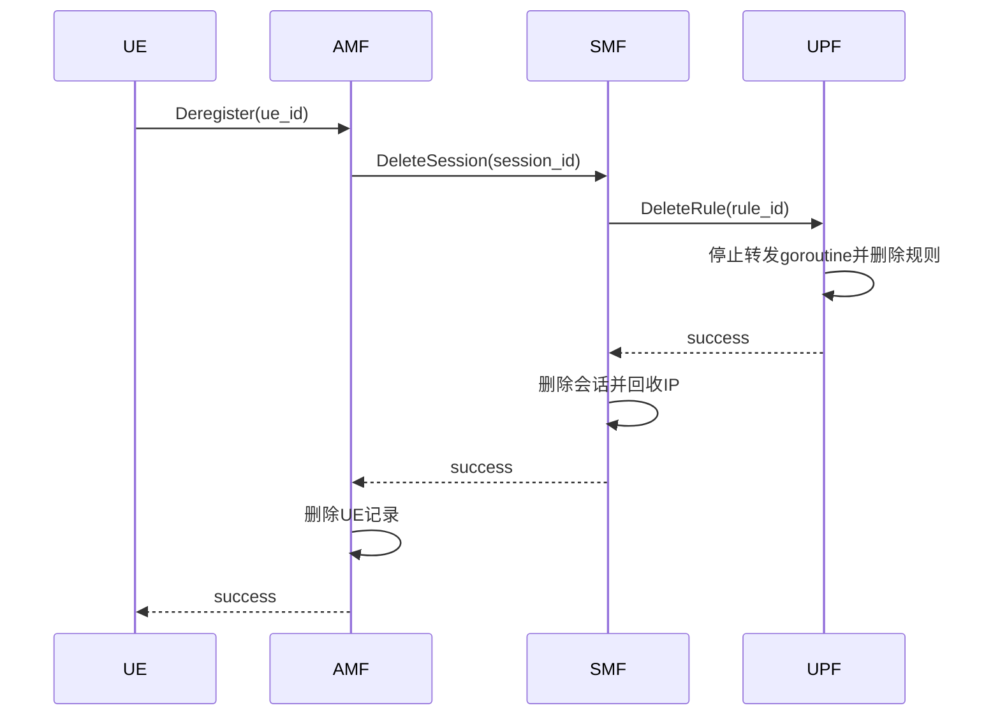

# LiteCore 架构说明

## 1. 项目定位

LiteCore抽取5G核心网中最容易用于教学和软件实验的控制流程，以gRPC代替复杂的3GPP接口协议。研究重点是核心网元间的状态传递、并发处理、错误传播、控制面延迟和故障表现。

## 2. 模块职责

### UE

产生信号功率和SINR，调用AMF注册；批量模式并发创建UE并统计端到端延迟。信道模型是可替换模块，未来可读取导师模型的输出。

### AMF

验证UE参数和信道质量，维护UE注册状态，调用SMF建立或释放会话。阈值为信号功率不低于-110 dBm且SINR不低于0 dB。

### SMF

维护会话、UE映射和IP池；调用UPF创建与删除规则。UPF创建失败时回滚会话与IP，避免残留半完成状态。

### UPF

维护会话对应的模拟转发规则，并由goroutine周期性增加包计数。删除规则时使用context取消对应goroutine。

## 3. 注册时序

CreateSession或CreateRule失败时，错误向上返回；SMF会回收已预留IP。重复注册返回已有资源，不重复分配。

## 4. 注销时序

删除接口是幂等的：资源已经不存在时仍返回成功。

## 5. 可靠性设计

- 所有跨服务调用使用3秒超时。
- gRPC错误保留Unavailable、InvalidArgument等语义。
- AMF、SMF、UPF内部状态由RWMutex保护。
- 创建接口检查既有资源，避免重复创建。
- UPF失败时SMF执行补偿回滚。
- 服务支持SIGINT/SIGTERM优雅退出。
- gRPC健康服务用于编排环境探测。

## 6. 已知限制

- 状态仅在内存中，Pod重启会丢失；单副本清单是刻意设计。
- 并发的完全相同UE请求在第一次创建尚未完成时可能收到Aborted，客户端可以稍后重试。
- UPF不处理真实IP包。
- 阈值是实验参数，不代表3GPP标准要求。
- 没有鉴权、加密、用户数据库和标准服务发现。
